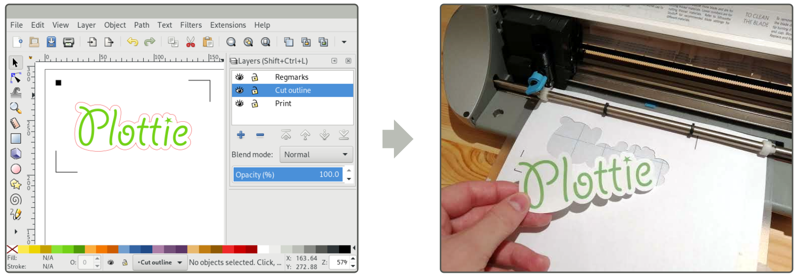

Plottie: A little plotting/cutting program for Silhouette Plotters
==================================================================

Plottie is a command-line tool for plotting and cutting outlines from [SVG
vector graphics](https://developer.mozilla.org/kab/docs/Web/SVG) using the
[Silhouette series of desktop
plotters/cutters](https://www.silhouetteamerica.com/).

Key features:

* **Supports most common SVG features** including beziers, shapes, simple text
  and dashed lines (via the
  [`svgoutline`](https://github.com/mossblaser/svgoutline) library).

* **Supports registration marks** allowing printed shapes to be accurately cut
  out or scored.

* **Sensible defaults** mean that registration marks, plot mode and the
  layers to include are usually auto-detected.

* **Selectively filter what to cut or plot** based on colour, layer or SVG
  object IDs or classes.

* **Cut and mark order optimised for speed and integrity.** For example, when
  cutting, the inner-most shapes are cut out first so adhesive-free cutting
  mats can be used. Alternatively, the order used in the provided SVG can be
  used instead if required.

* **Inkscape-aware** allowing layer names to be used to specify what to cut or
  plot. Also accounts for incorrect DPI settings in files produced prior to
  Inkscape v0.92.

Usage
-----

Plottie can be installed from [PyPI](https://pypi.org/project/plottie/) as
usual:

    $ pip install plottie

In most cases, all you need to do is run `plottie` with your SVG file as
the argument:

    $ plottie path/to/my/drawing.svg

If you don't have a device attached, you can use the `--use-dummy-device/-D`
option to instead generate an SVG showing the cuts or marks to be made:

    $ plottie path/to/my/drawing.svg -D cuts_made.svg

By default Plottie will attempt to work out whether you want to cut or plot the
outlines in the supplied file by looking for Inkscape layer names with names
like `Cut` or `Plot`. You can override this (or choose the appropriate mode
for non-Inkscape SVGs) using the `--plot/-p` or `--cut/-c` arguments:

    $ plottie --plot file/to/plot.svg

The speed and force used for cutting and plotting may be specified either in
mm/s or g (respectively) or as a percentage of the device's supported values
using the `--speed/-S` and `--force/-F` options.  By default 100% speed and
20% force are used. For example, these could be overridden when cutting out a
particularly tough material like so:

    $ plottie --speed 50% --force 100% path/to/my/drawing.svg

By default, Plottie will plot or cut all stroked paths from Inkscape layers
with names like 'Cut' or 'Plot', making them visible if they are hidden and
hiding all other layers. Various options are provided for specifying
alternative filters, for example:

    $ # Include everything already visible
    $ plottie --all path/to/my/drawing.svg
    
    $ # Include only the Inkscape layer called 'Picture Outline'
    $ plottie --layer "Picture Outline" path/to/my/drawing.svg
    
    $ # Include only the object with SVG ID 'object1234' (and its chidren)
    $ plottie --id object1234 path/to/my/drawing.svg
    
    $ # Include just objects (and their children) with SVG class name 'cuttable'
    $ plottie --class cuttable path/to/my/drawing.svg
    
    $ # Include onjects with a red stroke colour
    $ plottie --colour '#FF0000' path/to/my/drawing.svg

To see the complete set of options, and for more detailed documentation, use
`--help/-h`.

Example files
-------------

An example Inkscape SVG demonstrating the use of registration marks and cutting
features is included in
[`examples/cutting_example.svg`](./examples/cutting_example.svg). This file can
be directly printed to an A4 page and then cut out using:

    $ plottie examples/cutting_example.svg

For convenience, a template set of registration marks is also provided in
[`examples/regmark_template.svg`](./examples/regmark_template.svg) which
includes correctly sized markers and strokes.

Comparison with other software
------------------------------

Plottie is intended to be a relatively robust and featureful tool for cutting
and plotting using [Silhouette](https://www.silhouetteamerica.com/) plotters
and cutters.

The official [Silhouette Studio
software](https://www.silhouetteamerica.com/software) provides a complete
integrated design and cutting solution. Plottie, by comparison, provides only a
command-line based cutting/plotting function. All design and drawing tasks are
deferred to more capable tools (such as [Inkscape](https://inkscape.org/) or
[Illustrator](https://www.adobe.com/illustrator)). Plottie also works on more
platforms, including Linux.

There are also numerous other unofficial tools for driving Silhouette plotters,
most notably [Robocut](https://github.com/nosliwneb/robocut) and
[Inkscape-Silhouette](https://github.com/fablabnbg/inkscape-silhouette)).
Unlike Plottie, both of these tools provide graphical interfaces and direct
integrations with graphics packages such as Inkscape. However, both have
limitations in terms of their lack of support for some SVG features (notably
including text and dashed lines). Further, dealing with registration marks and
selecting layers to print, vs those to plot is typically a fairly manual
process.

As a command-line only tool, Plottie is not suited to everyone. However, for
those comfortable with such interfaces, Plottie may arguably be easier and
quicker to use than the tools above, particularly given its numerous automatic
features. For particularly complex or batch jobs, Plottie can also be driven as
part of a shell script.

License
-------

GNU Lesser General Public License v3 (LGPLv3)
